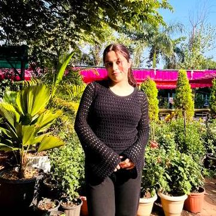

  

  

  <a onclick="showSection('home')">Home</a>
  <a onclick="showSection('projects')">Projects</a>
  <a onclick="showSection('cv')">CV</a>
  <a onclick="showSection('publications')">Publications</a>
  <a onclick="showSection('contact')">Contact</a>
  <a onclick="showSection('about-detail')">About in Detail</a>

  

    

      
    

    

      <a class="social-link" href="https://www.linkedin.com/in/vanshika-s-304185308/" target="_blank">
        LinkedIn
      </a>
      <a class="social-link" href="https://github.com/vanshika-s12" target="_blank">
        GitHub
      </a>
      <a class="social-link" href="https://mail.google.com/mail/?view=cm&fs=1&to=vanshikasachdevaaa12@gmail.com" target="_blank" rel="noopener">
        Email
      </a>
    

  

  

    <!-- HOME -->
    

      

        

          Hi! I'm Vanshika, a driven student passionate about science, AI, and research. I recently completed high school and have engaged in global issue workshops at The Indian Vidyarthi, focusing on urban water management, sustainability, and innovative business strategies. My journey includes authoring a research paper on Quantum Temporal Lattice Theory (QTL) in IJSAT, developing practical ML and automation tools, and consistently winning accolades in science exhibitions and hackathons. I thrive on creative problem-solving, research writing, and building solutions that blend technology with real-world impact.
        

        <h1 class="updates-heading">Updates</h1>
        

          
<strong>2025:</strong> Contributed to a peer-reviewed research paper on Quantum Temporal Lattice Theory, exploring time manipulation using quantum mechanics and string theory.

          
<strong>2024:</strong> Selected as a Summer Student at The Indian Vidyarthi, India; participated in workshops on global issues and sustainable practices, and wrote on urban water management.

          
<strong>2024:</strong> Won First Prize in the annual school science exhibition for the most innovative and impactful project.

          
<strong>2023:</strong> Received a 90% scholarship for academic excellence at PW.

          
<strong>2023:</strong> Won a ₹7,000 cash prize in a hackathon and secured 2nd place in a CLI-based automation challenge for building the CMD Error Detector and Fixer tool.

          
<strong>2023:</strong> Participated at the national level in spell bees and was invited to India’s Got Talent.

          
<strong>2023:</strong> Secured 2nd position in Nav Sadhana Singing Competition among thousands of participants.

          
<strong>2022-2024:</strong> Developed and published multiple ML/AI projects: Spam Email Classifier, Sentiment Analyzer, Pattern Finder, Digit Recognizer, Log Error Detector, and Regex-based Data Extractor.

          
<strong>2016-2022:</strong> Raised donations for visually and hearing-impaired children and consistently participated in academic and extracurricular events.

        

      

    

    <!-- PROJECTS -->
    

      

        

          <h1>Projects</h1>
        

        <ul class="projects-list">
          <li>
            <strong>Quantum Temporal Lattice Theory (QTL), IJSAT</strong> 
            Authored a peer-reviewed research paper exploring theoretical concepts of localized time manipulation through quantum mechanics, string theory, and holographic encoding. Proposed the creation of time loops by altering encoded space-time data.
          </li>
          <li>
            <strong>Spam Email Classifier</strong> 
            Built a Python spam detector using Scikit-learn (Naive Bayes), regex for feature extraction, and accuracy/loss functions for evaluation.
          </li>
          <li>
            <strong>Simple Sentiment Analyzer</strong> 
            Classified sentences as positive/negative using logistic regression and regex-based text preprocessing. Visualized loss/accuracy plots.
          </li>
          <li>
            <strong>File Name Pattern Finder</strong> 
            Developed a tool to scan directories and use regex for finding files matching patterns (e.g., dates, versions), with optional ML-based classification.
          </li>
          <li>
            <strong>Handwritten Digit Recognizer (MNIST)</strong> 
            Used the MNIST dataset with neural networks (Keras/Scikit-learn); logged loss and accuracy during training and visualized misclassified digits.
          </li>
          <li>
            <strong>Basic Log File Error Detector</strong> 
            Employed regex to find error patterns in log files, used clustering (KMeans) to group similar errors, and visualized cluster loss.
          </li>
          <li>
            <strong>Regex-based Data Extractor with ML Post-Processing</strong> 
            Extracted phone numbers/emails using regex, then classified snippets with a simple ML model, plotting loss during training.
          </li>
        </ul>
      

    

    <!-- CV SECTION -->
    

      

        <a class="cv-fullscreen-link" href="assets/vanshika_cv.pdf" target="_blank" rel="noopener">
          Click to open in fullscreen
        </a>
        <a class="cv-download-link" href="assets/vanshika_cv.pdf" download>
          Download
        </a>
      

      <iframe class="cv-iframe-box" src="assets/vanshika_cv.pdf"></iframe>
    

    

      <h1>Publications</h1>
      

        I have published a research paper on Quantum Temporal Lattice Theory (QTL) in the International Journal for Science, Arts and Technology (IJSAT). 
        The paper explores the concept of localized time manipulation using quantum mechanics, string theory, and holographic encoding, proposing ways to create time loops by altering encoded space-time data.
      

    

    

      <h1>Contact</h1>
      
Email me at <a href="mailto:vanshikasachdevaaa12@gmail.com">vanshikasachdevaaa12@gmail.com</a>

    

    <!-- ABOUT IN DETAIL: SCROLLABLE BOX -->
    

      

        
This section contains life updates in detail:

        

          <strong>2025:</strong> Contributed to a peer-reviewed research paper on Quantum Temporal Lattice Theory (QTL) in IJSAT, investigating theoretical models for time manipulation using quantum mechanics and string theory.  
          <strong>2024:</strong> Selected as a Summer Student at The Indian Vidyarthi, India. Participated in global issue workshops, wrote on urban water management, and explored sustainable practices and innovative business strategies.  
          <strong>2024:</strong> Won First Prize in the school science exhibition for the most innovative and impactful project, demonstrating creativity and strong presentation skills.  
          <strong>2023:</strong> Received a 90% merit scholarship at PW for academic excellence. 
          Won a ₹7,000 cash prize and 2nd place in a CLI-based hackathon for building the CMD Error Detector and Fixer tool. 
          Invited to India’s Got Talent at the national level and participated in national-level spell bees. 
          Secured second position in Nav Sadhana Singing Competition among thousands of competitors.  
          <strong>2016-2022:</strong> Raised donations for visually and hearing-impaired children, participated in academic and extracurricular competitions, and consistently delivered innovative projects in annual science exhibitions.
        

      

    

  

